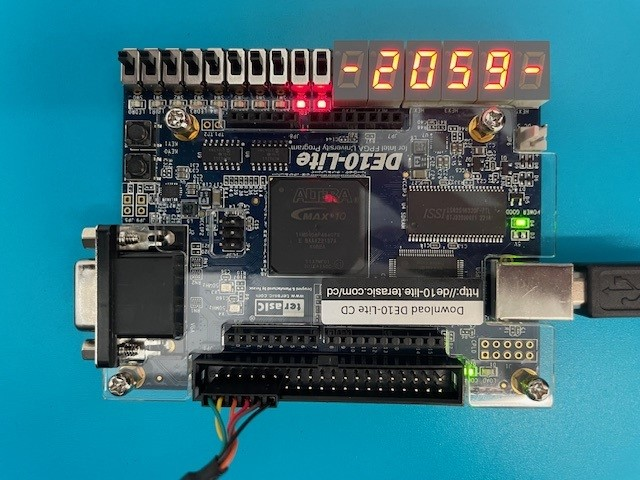

# SBC 6502
This is a small educational retro-SBC (Single Board Computer) programmable in Basic and implemented in Verilog.

Please refer to the Linkedin article for its explanation.

There are 5 projects for 5 different boards:

* **Sipeed Tang Nano 9k**
* **Sipeed Tang Nano 20k**
* **Sipeed Tang Primer 25k**
* **Digilent CMOD-A7 35T**
* **Terasic DE-10 Lite**

## Acknowledgements

* Thanks to **WangXuan95** for its SD-Card Reader IP   
https://github.com/WangXuan95/FPGA-SDcard-Reader
* Thanks to **Brian Guralnick** for its Sync RS232 IP  
https://github.com/BrianHGinc/Verilog-RS232-Synch-UART-RS232-Debugger-and-PC-host-RS232-Hex-editor
* Thanks to **Grant Searle** for its modified 6502 ISO Basic  
You can find it <a href="http://searle.x10host.com/6502/osi_bas.zip" target="_blank">here</a>

## Article

<a href="https://www.linkedin.com/pulse/arduino-pro-fpga-perfect-marriage-extreme-tasks-lets-how-nardella-mqfxf" target="_blank">English version</a>

<a href="https://www.linkedin.com/pulse/arduino-pro-fpga-un-matrimonio-perfetto-per-compiti-estremi-nardella-xos3f" target="_blank">Italian version</a>

*Have fun*
